# AI_Postproduktion_VFX_Vault Knowledge Graph

## Karpathy-Status

- Lifecycle: `map / graph`
- Rolle: Navigation / Themenstruktur
- Evidenzmodus: verlinkte Vault-Struktur
- Denkraum: erlaubt, solange Status und Unsicherheit sichtbar bleiben.
- Nicht als Claim nutzen: nicht als Forschungsclaim zitieren.
- Nächster Prüfschritt: Links aktuell halten.

## Zweck

- zentrale Knoten
- vorhandene Links
- prüfbare Nachbarschaften
- Brücken zu anderen Vaults

## Zentrale Knoten

| Knoten | Typ | Linkgrad |
|---|---|---|
| [[../../00_Index/Start_Hier|Digital Rooms]] | `note` | 57 |
| [[../../00_System/index|System Index]] | `note` | 30 |
| [[../concepts/README|Concepts]] | `concept` | 28 |
| [[../../review/README|Review Layer]] | `review` | 26 |
| [[../syntheses/README|Syntheses]] | `synthesis` | 26 |
| [[../../15_Promotion/Promotion_Index|Promotion: Digital Rooms]] | `note` | 25 |
| [[../index|Research Wiki Index]] | `note` | 23 |
| [[../sources/README|Sources]] | `source` | 23 |
| [[../../README|Digital Rooms, AI und Postproduktion]] | `note` | 20 |
| [[../../outputs/README|Outputs]] | `output` | 20 |
| [[../../raw/README|Raw Sources]] | `note` | 20 |
| [[../../16_Digital_Image_Space/Digital_Image_Space_Index|Digital Image Space und Digital Rooms]] | `note` | 18 |
| [[../../15_Promotion/Denkachsen_Register|Denkachsen Register]] | `note` | 17 |
| [[../../15_Promotion/Public_Built_Room|Public / Built Room (Fallcluster 3)]] | `note` | 9 |
| [[../../00_System/Vault_Operating_System|Vault Operating System]] | `note` | 7 |
| [[../../01_Tools_und_Modelle/Tool_Landschaft_2026|Tool-Landschaft 2026]] | `note` | 7 |
| [[../syntheses/pressespiegel-ai-video-governance-2026-05-16|Synthese: Pressespiegel KI, 16.05.2026]] | `synthesis` | 7 |
| [[../syntheses/pressespiegel-ai-video-wave2-2026-05-16|Evidenzsynthese: Pressespiegel Wave 2, 16.05.2026]] | `synthesis` | 7 |

## Beziehungstypen

| Beziehung | Bedeutung |
|---|---|
| `verlinkt` | vorhandener Obsidian- oder Markdown-Link |
| `stuetzt` | Verbindung zu Quelle oder Belegseite |
| `konkretisiert` | Verbindung zu Konzept oder Begriff |
| `braucht_review` | Verbindung zu Review- oder Prüfebene |
| `uebertraegt_auf` | Verbindung zu anderem Vault |

## Graph-Ausschnitt

```mermaid
graph TD
  N1["Start_Hier"] -->|verlinkt| T1["Digital_Rooms"]
  N2["Start_Hier"] -->|verlinkt| T2["Digital_Rooms_Erweiterte_Felder"]
  N3["Start_Hier"] -->|verlinkt| T3["Promotionsformel_Digital_Rooms"]
  N4["Start_Hier"] -->|verlinkt| T4["Digital_Rooms_Mapping_Matrix"]
  N5["Start_Hier"] -->|verlinkt| T5["Denkachsen_Register"]
  N6["Start_Hier"] -->|verlinkt| T6["Digital_Image_Space_Index"]
  N7["Start_Hier"] -->|verlinkt| T7["Digital_Image_Space_Begriff"]
  N8["Start_Hier"] -->|verlinkt| T8["Latent_Space_als_Gestaltungsraum"]
  N9["Start_Hier"] -->|verlinkt| T9["Operative_Bildräume"]
  N10["Start_Hier"] -->|verlinkt| T10["Interface_als_Bildraum"]
  N11["Start_Hier"] -->|verlinkt| T11["Vom_Frame_zur_Szene"]
  N12["Start_Hier"] -->|verlinkt| T12["Neural_Rendering_und_räumliche_Bilder"]
  N13["Start_Hier"] -->|verlinkt| T13["Neural_Codecs"]
  N14["Start_Hier"] -->|verlinkt| T14["Hybrid_Workflows_als_Digital_Rooms"]
  N15["Start_Hier"] -->|verlinkt| T15["Rotoscoping_und_AI_VFX"]
  N16["Start_Hier"] -->|verlinkt| T16["Bedeutung_für_Postproduktion"]
  N17["Start_Hier"] -->|verlinkt| T17["Emerging_Technologies"]
  N18["Start_Hier"] -->|verlinkt| T18["Public_Built_Room"]
```

## Verbindungen

- [[ai-postproduktion-vfx-vault-graph-edges]]
- [[ai-postproduktion-vfx-vault-cross-vault-bridge]]
- [[../operations/graph-query-layer]]
